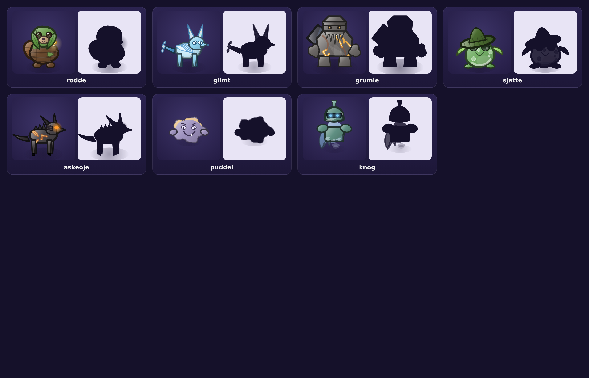

# Critter Clash

A tactical auto-battler roguelite that runs in a browser. Build a team of
elemental critters, place them on a 3×2 board, and fight through three acts of a
branching map.

Open `index.html`. That is the whole install — no build step, no dependencies, no
network. It works from `file://`, offline, on a phone or a desktop.



---

## The game

**Placement is the puzzle.** Each side fights from a 3×2 board. The front row
takes every melee hit and the back row is unreachable until the front row falls,
so where a critter stands changes what it does and what happens to it.

**Bonds make the board a decision.** Every critter has a Bond — a bonus for
standing next to a particular ally, or for being in the right row. Bonds are
checked against orthogonal neighbours, so moving one critter can change three
others. There is no single correct formation, only a best one for the team you
happen to have.

**Elements are about tempo, not just damage.** Five elements form one loop:

```
Tide → Ember → Bloom → Stone → Spark → Tide
```

Attacking with the advantage deals 1.5× damage **and** builds ultimate energy 50%
faster. Attacking into a resistance deals 0.7×. Matching elements is therefore a
decision about when your ultimates come online, not only about a damage number.

**Ultimates are the thing you actually play.** Critters charge energy by dealing
and taking damage. At full charge their portrait glows and you tap to fire.
Holding a heal for one more second, or a stun until the enemy commits, is where
fights are won. `Auto` exists if you would rather watch.

**The run is a series of choices.** Three acts, each a branching map of fights,
elites, shops, camps, caches and a boss. Health carries between battles, so a
cheap win is worth more than a spectacular one. Lose your whole team and the run
ends.

Fifteen playable critters, five elements, five roles, fourteen relics. No
timers, no energy meters, no purchases, no gacha. Everything is earned by
playing.

---

## Controls

| Action | How |
| --- | --- |
| Move a critter | Tap it, then tap a slot. Tapping an occupied slot swaps. |
| Auto-arrange | The ↻ button on the formation screen |
| Fire an ultimate | Tap a glowing portrait, or press `1`–`6` |
| Change speed | The `1×` button during a fight |

---

## How it is built

Plain ES5-era JavaScript in classic `<script>` tags, so it loads from the file
system with no server and no bundler. Roughly 4,500 lines across nine modules.

| File | What it owns |
| --- | --- |
| `js/util.js` | Maths, colour, seeded RNG, storage |
| `js/audio.js` | Every sound, synthesised with WebAudio |
| `js/art.js` | The vector critter renderer |
| `js/roster.js` | Elements, roles, and all critter definitions |
| `js/combat.js` | The battle simulation — no DOM, runs headless |
| `js/run.js` | Map generation, encounters, relics, rewards |
| `js/battleview.js` | Drawing a battle |
| `js/ui.js` | Screens and the battle loop |
| `js/main.js` | Boot and global wiring |

### The art is code

There are no image files. Every critter is drawn from a spec object — a base
colour, a body shape, ears, eyes, a tail, and a few extras — through one
renderer that lights all of them the same way: a gradient fill, a contact shadow
where the head meets the body, a rim light along the lower right, and an outline
tinted from the fill rather than pure black.

That is a deliberate trade. Hand-drawn or generated sprites would each carry
their own lighting, scale and style; deriving everything from one renderer means
a new critter cannot look out of place, the whole cast can be restyled by
editing one function, and the game stays a few hundred kilobytes of text that is
crisp at any resolution.

### Verifying it

Two harnesses, both headless:

```bash
node tools/sim.js 100     # play 100 complete runs, report the difficulty curve
node tools/shots.js       # drive the real game in Chromium, fail on any error
node tools/sheet.js       # render a contact sheet of every critter
```

`tools/sim.js` plays full runs with a deliberately crude policy — auto-arranged
formations, ultimates on cooldown, greedy rewards. It exists to answer a
question that is hard to eyeball: is the game winnable, and does it get harder?
The current build reports:

```
runs simulated: 100
  won   70 (70%)
  lost  30
deaths by act: act1=7  act2=7  act3=16
deaths by node type: {"boss":20,"elite":8,"battle":2}
```

Deaths rising act over act, concentrated on bosses and elites, is the shape a
roguelite should have. A player who thinks about bonds and holds ultimates
should beat that bot; a careless one will not.

`tools/shots.js` clicks through the actual game in Chromium — title, codex,
formation, a full battle, a reward — and exits non-zero on any console error or
unhandled exception. Two bugs it caught that no amount of reading would have:
a canvas whose background loop stepped by `width / 8` and hung forever when the
canvas had not been laid out yet, and a status tint drawn with `source-atop`
that painted the whole field instead of the critter.

---

## Licence

Do what you like with it.
