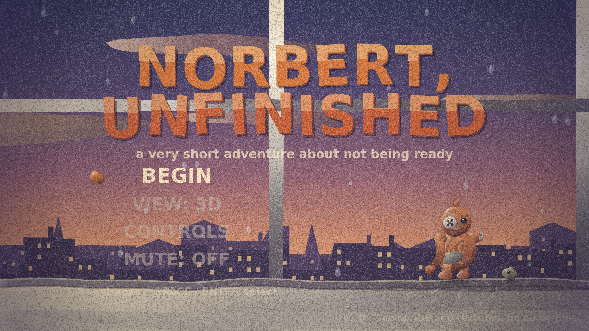
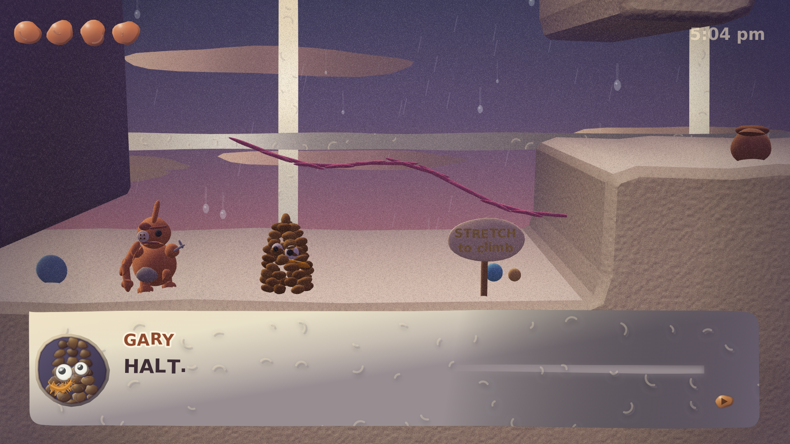
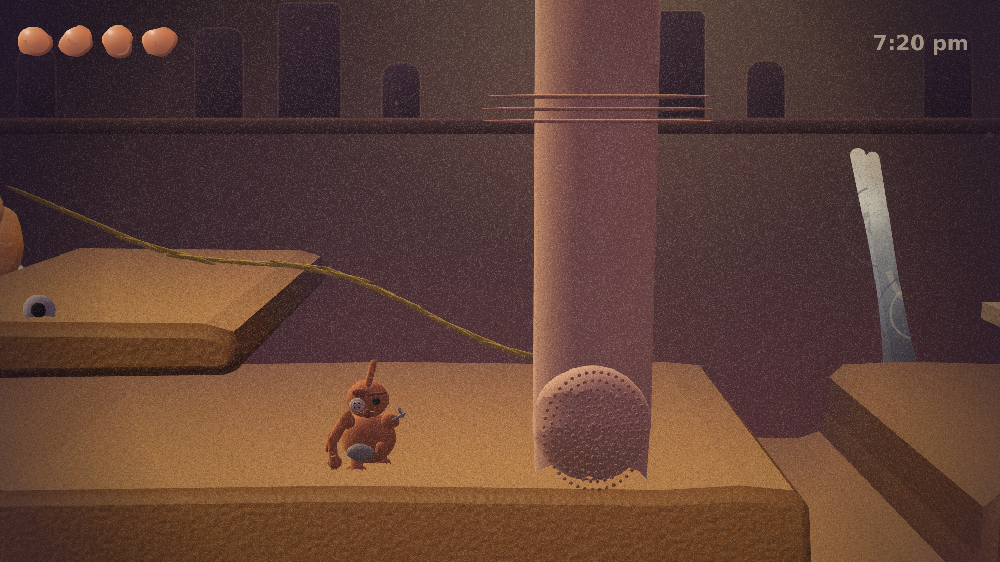
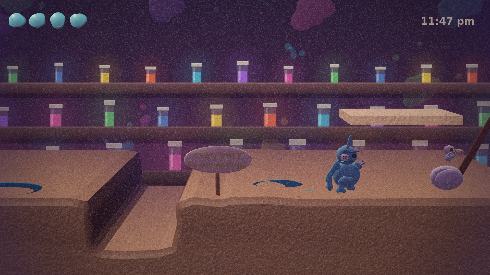
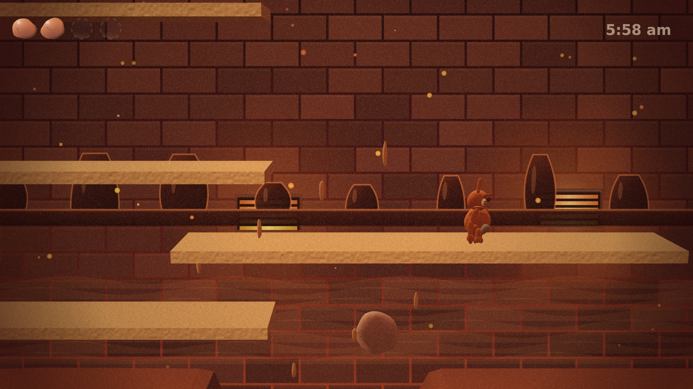
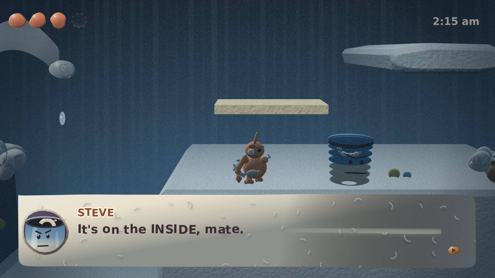
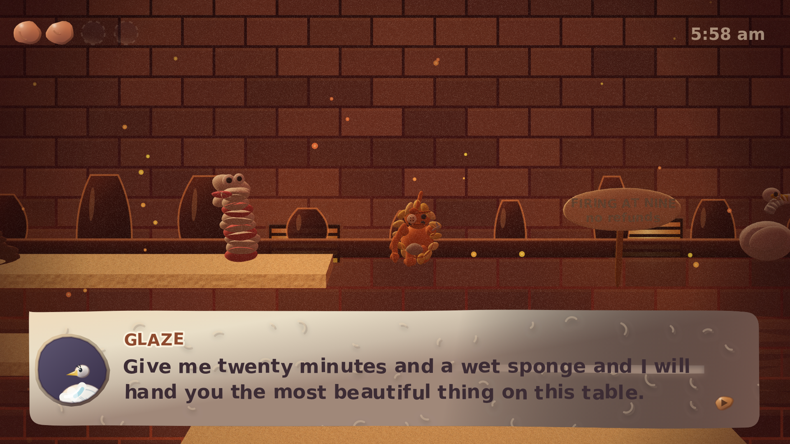

# NORBERT, UNFINISHED

*A very short adventure about not being ready.*

A cozy, funny, hand-sculpted-looking puzzle-platformer that runs in a browser
and takes about an hour to finish. Every pixel of it — every character, every
hillside, every squelch, every note of the score — is generated at runtime from
maths. There are no image files, no fonts, no audio files, and no engine.



---

## The pitch

Tuesday, 4:58 pm. Craft Club is over.

A nine-year-old called Ivy made you out of one lump of terracotta and forty
minutes. She ran out of both. You have one long noodle arm and one nub with the
armature wire still sticking out of it, a shirt button for a left eye, a bead
for a right eye, a thumbprint dent in your forehead, and no name.

At nine o'clock tomorrow morning, everything on the drying rack goes into the
kiln and comes out **FINISHED**. Everyone on the table wants this. It is the
happiest day of your life. Everyone says so.

Unfinished clay has air trapped in it. Air, at nine hundred degrees, would very
much like to be somewhere else.

You have one night.

---

## The hook

You are made of clay, so you can **change** — and the game's whole design is
built on making that cost something.

| Move | Key | What it's for |
|---|---|---|
| Squash flat | hold **↓** | Fit under one-tile gaps, press heavy plates, slide |
| Wind up | hold **↓**, then **SPACE** | A spring jump six tiles high |
| Stretch tall | hold **↑** by a ledge, then **SPACE** | Pour yourself over ledges a jump can't reach |
| Tear off a piece | **J** / **Z** | A thrown chunk sticks where it lands: a step, a weight, a plug |
| Slurp it back | **K** / **X** | Pieces come flying home |

Your body is your ammunition, your platform and your health bar at once. You
carry four handfuls of yourself.

And three times in the story, you give one away **permanently**. A leg for a
one-legged pipe-cleaner flamingo. A plug for a draining sink. Each time, your
maximum drops, and **Norbert visibly gets smaller** — weaker jumps, fewer
pieces, harder puzzles. The HUD keeps the empty dents where they used to be.

The game gets harder because you were kind. That is the whole game.

---

## The cast

- **NORBERT** — one lump of terracotta, forty minutes, no name
- **GARY** — a pinecone with two crooked googly eyes and half a pipe-cleaner
  moustache, who is certain he is the Mayor. There was an election. He ran it.
- **MADAME PIPPA PIPECLEANER** — principal dancer of the Windowsill Ballet, for
  one entire glorious afternoon, until the hoover came
- **STEVE** — a mug. Fired. Came out wrong. The handle is on the *inside*.
- **BEANS** — beans
- **GLAZE** — a porcelain swan, flawless and symmetrical, who would genuinely
  love to help you become presentable, and that is the worst part
- **THE COUNCIL OF CRAFTS** — a sock puppet, a macaroni necklace and a
  papier-mâché volcano who has been preparing
- **THE THUMB** — as itself

---

## Running it

```bash
npx http-server -p 8099 .      # any static server will do
open http://127.0.0.1:8099/
```

Or build the standalone file and just open it:

```bash
node tools/build.mjs
open dist/norbert-unfinished.html
```

One HTML file, ~270 KB, no network, no dependencies. Works offline, wraps
straight into Electron or NW.js for a Steam build, and drops onto itch.io as-is.

---

## It is in 3D

The world is sculpted, not painted. `src/gl3d.js` is a small WebGL2 renderer
written for exactly one material — clay — with no library behind it: two
shaders, a unit sphere, a unit capsule and an instance batcher. Every character
in the game, every limb and every eye, is one of those two primitives with a
matrix and a colour. The ground is one static mesh per chapter, extruded out of
the same traced outlines the 2D renderer draws.

Nothing about the game changed. Same tile grid, same physics, same script,
same interface. `src/scene3d.js` only re-reads that state as geometry.

What makes it read as clay rather than as plastic:

- **Nothing is a true sphere.** The vertex shader displaces every surface by a
  sum of sine harmonics seeded per object — the same lumping the 2D renderer
  uses, in three dimensions — and corrects the normal with the surface
  gradient so the lighting follows the lump.
- **BOIL, still.** The lump phase is driven by `Clay.frame`, so the models
  themselves simmer at twelve frames a second while the game runs at sixty.
- **Thumbprints are in the normal.** Object-space value noise perturbs the
  shading normal, twice, at two frequencies: pressed marks and then the grain
  of the clay itself. Fired things — Steve, Glaze — skip it entirely and get a
  tight specular instead, so the material contrast that the story runs on
  survives the move.
- **Wrapped diffuse.** Clay is soft and slightly translucent, so it does not
  fall to black at the terminator, and light scatters through its thin edges.
- The picture is three stacked layers: the painted parallax backdrop on a 2D
  canvas, the 3D world, and the interface on a transparent 2D canvas on top —
  so the HUD, the dialogue, the film grain and the lens are pixel-identical in
  both modes.

`VIEW: 3D / 2D` on the title screen switches renderers at any time. The
original hand-drawn 2D renderer is still there, in full, and the game falls
back to it automatically if WebGL2 is missing — or if a device turns out not to
have the muscle for the sculpted view after the detail tuner has given back
everything else it can.

---

## On a phone

It is built to be played on a phone, not merely to survive on one.

**Landscape** is the way to play it. The picture is always 324 units tall and
its *width follows the screen*, so a 19.5:9 phone gets a wider view of the
table rather than black bars down the sides. The controls float over the bottom
corners at reduced opacity and fade out entirely while anyone is talking —
you only need "tap to continue" then, and a tap anywhere does it.

**Portrait** works too: picture up top, a full-size control deck along the
bottom, and a quiet note suggesting you turn the phone.

The details that make it feel native rather than ported:

- **Real DOM buttons, not painted rectangles.** Hit testing goes through
  `elementFromPoint` on every touch move rather than pointer capture, so you
  can roll a thumb from LEFT to RIGHT without lifting it — which is how people
  actually play platformers on a phone. Multi-touch works: hold RIGHT and hit
  JUMP.
- **Safe areas** are honoured, so nothing lives under the Dynamic Island or the
  home indicator, and nothing scrolls, bounces or zooms.
- **iOS audio** is unlocked with a silent sample inside the first real gesture,
  and suspended/resumed around `visibilitychange`.
- **Detail adapts both ways.** The renderer starts conservative on a touch
  device, then climbs back to full resolution if the device has headroom, and
  steps down — resolution first, surface detail second — if frames start
  slipping. A soft picture still reads as clay; a stuttering one doesn't read
  as anything. `PAUSE → DETAIL` overrides it with AUTO / SMOOTH / RICH.
- Add it to your Home Screen and it runs fullscreen with no browser chrome.

---

## How the look works

There is no art pipeline. `src/clay.js` is a small material shader for canvas 2D
and everything in the game goes through it.

- **Nothing is a circle.** Every silhouette's radius is a sum of sine harmonics
  seeded per object, so no two lumps are alike and nothing is symmetrical.
- **BOIL.** Real stop-motion trembles because the animator re-touched the model
  between frames. `Clay.frame` ticks at 12 fps and nudges every silhouette,
  every letter of dialogue, and the film grain, while the game runs at 60. This
  single trick does more for the claymation feel than anything else.
- **One light rig, six rooms.** Highlights lean towards a per-room key colour
  and shadows lean towards a per-room ambient, so changing two hex codes
  re-lights every object at once — violet dusk on the windowsill, cold steel in
  the sink, red heat in the kiln room.
- **Thumbprints.** Pressed ridges are a light stroke offset up-left of a dark
  stroke. Large surfaces get many small marks on a jittered grid rather than a
  few big ones, because a hillside was pressed with the same thumb a hundred
  times, not with one enormous thumb.
- **Terrain is sculpted, not tiled.** The tile grid is traced into closed
  outlines, resampled, corner-rounded and pushed around by noise, then baked
  into vertical strips at load. Levels look like slabs of clay, not tilemaps,
  and the whole landscape costs a few `drawImage` calls a frame.
- **The expensive things are baked.** Grain is one full-resolution sheet blitted
  from a shifting offset instead of a per-pixel pattern fill; the vignette and
  colour grade are one cached layer instead of two full-screen blends. On a
  phone those three passes cost more than the entire cast put together.

Audio is the same story: `src/audio.js` synthesises every squelch from filtered
noise with a falling pitch envelope, and the score is a small generative music
box with a different key, tempo and texture per room. Each character speaks in
blips tuned to their personality — Gary is a smug square wave, Beans is one flat
bloop.

---

## Layout

```
index.html            loads the sources in order
src/util.js           maths, noise, the colour/light model
src/clay.js           THE RENDERER — material, blobs, terrain outlines, grain
src/themes.js         six rooms: sky, parallax backdrop, light and dirt
src/audio.js          procedural SFX, character voices, generative score
src/fx.js             particles, camera, the clay-blob screen wipe
src/gl3d.js           the WebGL2 clay renderer: shaders, meshes, batcher
src/scene3d.js        the world as geometry: terrain extrusion, 3D rigs
src/input.js          keyboard, gamepad, touch
src/norbert.js        the hero's rig
src/cast.js           Gary, Pippa, Steve, Beans, Glaze, the Council, the Thumb
src/dialogue.js       typewriter box with hand-lettered wobble and portraits
src/world.js          tiles, physics, props, level runtime
src/levels.js         six chapters and the entire script
src/ui.js             title, HUD, chapter cards, pause, credits, touch buttons
src/game.js           scene manager, story beats, set pieces, main loop
src/shots.js          deterministic capture harness (not shipped)
tools/                build, screenshots, and the three test harnesses
```

---

## Tests

Two harnesses, both worth running after any level edit:

```bash
node tools/reach.mjs     # static reachability
node tools/smoke.mjs     # headless playthrough
node tools/mobile.mjs    # emulated iPhone, both orientations
```

`reach.mjs` builds the graph of standable surfaces in every chapter and floods
it using Norbert's real movement envelope — walk, two-tile jump, three-tile
stretch-flop, squash-crawl through one-tile gaps, falling — then asserts that
every pot, item, NPC, vat, plate, sign and exit is somewhere the player can
actually stand. It is the thing that catches "the pit in chapter four is one
tile too deep", which it did.

`smoke.mjs` boots every chapter, drives Norbert around with synthetic input for
forty seconds, and fails on any JS error, NaN position, or fall through the
world. It also renders the title, controls, pause, ending and credits screens so
every draw path is exercised.

`mobile.mjs` boots the shipped single-file build in an emulated iPhone 16 Pro
at DPR 3 with touch, taps past the title, drives Norbert with the on-screen
d-pad using real touch events, and reports frame rate, canvas backing size and
any horizontal overflow in both orientations.

```bash
node tools/screenshots.mjs   # regenerate screenshots/ from the live game
```

---

## Screenshots

Every image in `screenshots/` is the real game running in a real browser at
1920×1080, captured by `tools/screenshots.mjs`. Nothing is composited, mocked up
or retouched — `index.html?shot=<name>` poses a scene, simulates it forward at a
fixed timestep and parks on a settled frame.

| | |
|---|---|
|  |  |
|  |  |
|  |  |

---

*You are allowed to still be soft.*
